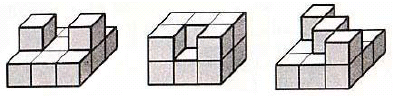

# 3D City Model [⬀](http://acm.sgu.ru/problem.php?contest=0&problem=519)

_Time limit per test: 0.25 second(s)_

_Memory limit: 262144 kilobytes_

_input: standard_

_output: standard_

A city is built on the top of a rectangular n x m grid where all the grid cells are equal squares. Each of the n · m grid cells can serve as a foundation of a single building in the city. A building is represented as a number of 1 x 1 x 1 cubes stacked on the top of each other. The cube that lays in the foundation of a building entirely occupies a single cell on the grid. It is clear that adjacent buildings can share a wall or a part of it. Typical cities can be seen on the image below.

The King of Berland has a 3D model of the capital city in his office. This model was made on a special 3D-printer out of plastic. It represents a layout of the capital city, but the scale is smaller, so it's very convenient for the King to examine the model without having to visit the city itself. The King is bored though because the model is colorless, so he wants to paint the model. To calculate the exact amount of required paint he should know the total area of the model's surface.

You have to help the King and write a program that will calculate the required surface area of the given model. While calculating the surface area you should count not only the side surfaces, but also the areas of the top and bottom facets.

The model is given to you as n x m matrix of digits. A digit in the j-th position of the i-th row stands for the height of the building with its foundation in cell (i, j) of the model. If the corresponding digit is equal to "0", it means there is no building built on the top of this cell.

## Input
The first line of input contains a pair of integers n, m (1 ≤ n,m ≤ 100), where n — amount of rows in the given grid, m — amount of columns. The following n lines contain the description of the model. These n lines contain m digits each representing heights of the buildings. It's guaranteed that the given matrix contains at least one non-zero digit.

## Output
Output the only positive integer — surface area of the model.

## Example(s)

| sample input               | sample output |
|:---------------------------|:--------------|
|3 3 111 212 111 | 38            |

| sample input                  | sample output |
|:------------------------------|:--------------|
|3 4 1000 0010 0000 | 12            |

## Note
The first sample test corresponds to the leftmost picture from the problem statement.

Online Contester Team © 2002 - 2010. All rights reserved.
