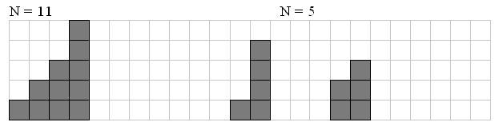

# Staircases [⬀](https://acm.timus.ru/problem.aspx?space=1&num=1017)

One curious child has a set of N little bricks. From these bricks he builds different staircases. Staircase consists of steps of different sizes in a strictly descending order. It is not allowed for staircase to have steps equal sizes. Every staircase consists of at least two steps and each step contains at least one brick. Picture gives examples of staircase for `N=11` and `N=5`:

Your task is to write a program that reads the number `N` and writes the only number `Q` — amount of different staircases that can be built from exactly `N` bricks.

## Input

Number `N` (`5 ≤ N ≤ 500`).

## Output

Number `Q`

## Sample

<table>
<tr>
<th>input</th>
<th>output</th>
</tr>
<tr>
<td style="vertical-align: top">
<pre>
5
</pre>
</td>
<td style="vertical-align: top">
<pre>
2
</pre>
</td>
</tr>
<tr>
<td style="vertical-align: top">
<pre>
212
</pre>
</td>
<td style="vertical-align: top">
<pre>
995645335
</pre>
</td>
</tr>
</table>
