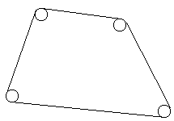

# Rope [⬀](https://acm.timus.ru/problem.aspx?space=1&num=1020)

Plotters have barbarously hammered `N` nails into an innocent plane shape, so that one can see now only heads. Moreover, pursuing their mean object, they have hammered all the nails into the vertices of a convex polygon. After that they… it is awful… have roped off the nails, so that the shape felt upset (the rope was very thin). They’ve done it as it is shown in the figure.

Your task is to find out a length of the rope.

## Input

There two numbers in the first line of the standard input: `N` — a number of nails (`1 ≤ N ≤ 16`), and a real number `R` — a radius of heads of nails. All the heads have the same radius. Further there are `N` lines, each of them contains a pair of real coordinates (separated by a space) of centers of nails. An absolute value of the coordinates doesn’t exceed 100. The nails are described either in a clockwise or in a counterclockwise order starting from an arbitrary nail. Heads of different nails don’t overlap.

## Output

Output a real number with two digits precision (after a decimal point) — a length of the rope.

## Sample

<table>
<tr>
<th>input</th>
<th>output</th>
</tr>
<tr>
<td style="vertical-align: top">
<pre>
4 1
0.0 0.0
2.0 0.0
2.0 2.0
0.0 2.0
</pre>
</td>
<td style="vertical-align: top">
<pre>
14.28
</pre>
</td>
</tr>
</table>