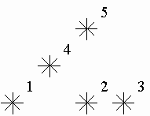

# Stars [⬀](https://acm.timus.ru/problem.aspx?space=1&num=1028)

Astronomers often examine star maps where stars are represented by points on a plane and each star has Cartesian coordinates. Let the level of a star be an amount of the stars that are not higher and not to the right of the given star. Astronomers want to know the distribution of the levels of the stars.

For example, look at the map shown on the figure above. Level of the star number 5 is equal to 3 (it's formed by three stars with a numbers 1, 2 and 4). And the levels of the stars numbered by 2 and 4 are 1. At this map there are only one star of the level 0, two stars of the level 1, one star of the level 2, and one star of the level 3.

You are to write a program that will count the amounts of the stars of each level on a given map.

## Input

The first line contains an integer N that is a number of stars (`1 ≤ N ≤ 15000`). The following N lines contain integers `Xᵢ` and `Yᵢ` that are coordinates of stars (`0 ≤ Xᵢ, Yᵢ ≤ 32000`). There can be only one star at one point of the plane. Stars are listed in ascending order of `Y` coordinate. Stars with equal `Y` coordinates are listed in ascending order of `X` coordinate.

## Output

Output `N` integers, one per line. The first line should contain an amount of stars of the level 0, the second does an amount of stars of the level 1 and so on, the last line contains an amount of stars of the level `N − 1`.

## Sample

<table>
<tr>
<th>input</th>
<th>output</th>
</tr>
<tr>
<td style="vertical-align: top">
<pre>
5
1 1
5 1
7 1
3 3
5 5
</pre>
</td>
<td style="vertical-align: top">
<pre>
1
2
1
1
0
</pre>
</td>
</tr>
</table>
