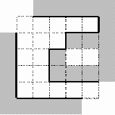

# Labyrinth [⬀](https://acm.timus.ru/problem.aspx?space=1&num=1033)

Administration of the labyrinth has decided to start a new season with new wallpapers. For this purpose they need a program to calculate the surface area of the walls inside the labyrinth. This job is just for you!

The labyrinth is represented by a matrix `N × N`. Some matrix cells contain a dot character (‘`.`’) that denotes an empty square. Other cells contain a sharp character (‘`#`’) that denotes a square filled by monolith block of stone wall. All squares are of the same size `3 × 3` meters.

The walls are constructed around the labyrinth (except for the upper left and lower right corners, which are used as entrances) and on the cells with a diesis character. No other walls are constructed. There always will be a dot character at the upper left and lower right corner cells of the input matrix.

Your task is to calculate the area of visible part of the walls inside the labyrinth. In other words, the area of the walls' surface visible to a visitor of the labyrinth. Note that there's no holes to look or to move through between any two adjacent blocks of the wall. The blocks are considered to be adjacent if they touch each other in any corner. See picture for an example: visible walls inside the labyrinth are drawn with bold lines. The height of all the walls is `3` meters.

## Input

The first line contains an integer `N` (`3 ≤ N ≤ 33`; you see, ‘`3`’ is a magic digit!). The next `N` lines contain `N` characters each. Each line describes one row of the labyrinth matrix. In each line only ‘`.`’ and ‘`#`’ characters are used.

## Output

Output the exact value of the area of the wallpaper needed.

## Sample

<table>
<tr>
<th>input</th>
<th>output</th>
</tr>
<tr>
<td style="vertical-align: top">
<pre>
5
.....
...##
..#..
..###
.....
</pre>
</td>
<td style="vertical-align: top">
<pre>
198
</pre>
</td>
</tr>
</table>
