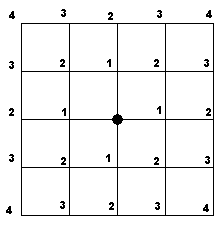

# Branches [⬀](https://acm.timus.ru/problem.aspx?space=1&num=1121)

SKB Kontur has a lot of branches scattered all over the city. The company management decided to create a guide that will help clients to choose which of the branches they need. You are asked for help in this work.

The city is represented in the form of a grid of blocks. Each block is a square whose sides are streets and whose corners are cross-roads. We suppose that all branches are located exactly at cross-roads. The branches of SKB Kontur are of different types: service centers, warehouses, shops, training centers and so on.

Let's mark service centers with number 1, warehouses with number 2, shops with number 4, training centers with number 8 and so on. There are not more than 11 types of branches, and two branches of the same type cannot be located at the same cross-road. Each cross-road is assigned a number equal to the sum of numbers with which the branches located at this cross-road are marked. Crossroads at which there are no branches of SKB Kontur are assigned 0.

Let the distance between two cross-roads be equal to the number of street segments which one has to go from the first cross-road to the second (see picture). For example, the distance from a corner of a block to the opposite corner of this block is 2. For each cross-road at which there are no branches of SKB Kontur you have to find the sum of the numbers corresponding to the types of the branches nearest to this cross-road. For example, suppose that there are no branches at a given cross-road and at distance 1 from it, there is a branch of type 16 at distance 2, there are also two branches of type 8 and one of type 4 at distance 2 in other directions and there are no more branches at distance 2 from this cross-road. Then we should output number 28=16+8+4 for this cross-road. We do not take into consideration branches that are at distances greater than 5 from a given cross-road. Thus, if a cross-road does not have branches of SKB Kontur that are located at distances less than 6 from it then we should output 0 for this cross-road.

## Input

The first line contains positive integers `H` and `W` not exceeding 150. They are numbers of "vertical" and "horizontal" streets, correspondingly. The next `H` lines contain `W` numbers each, the `i`-th number in the `j`-th line describing types of the branches located at the cross-road of the `i`-th "vertical" and the `j`-th "horizontal" street.

## Output

You should output `H` lines containing `W` numbers each, the `i`-th number in the `j`-th line being equal to the sum of the numbers corresponding to the types of the branches nearest to the corresponding cross-road if there are no branches at this cross-road and `−1` otherwise.

## Sample

<table>
<tr>
<th>input</th>
<th>output</th>
</tr>
<tr>
<td style="vertical-align: top">
<pre>
5 5
0 0 2 0 2
0 0 0 0 0
0 0 0 0 0
0 0 0 5 0
1 0 0 4 0
</pre>
</td>
<td style="vertical-align: top">
<pre>
2 2 -1 2 -1
3 2 2 7 2
1 7 7 5 7
1 5 5 -1 5
-1 1 4 -1 4
</pre>
</td>
</tr>
</table>
