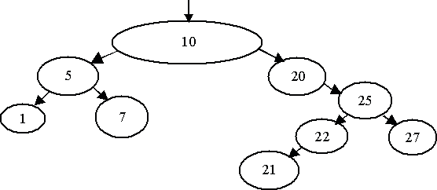

# Parliament [⬀](https://acm.timus.ru/problem.aspx?space=1&num=1136)

A new parliament is elected in the state of MMMM. Each member of the parliament gets his unique positive integer identification number during the parliament registration. The numbers were given in a random order; gaps in the sequence of numbers were also possible. The chairs in the parliament were arranged resembling a tree-like structure. When members of the parliament entered the auditorium they took seats in the following order. The first of them took the chairman’s seat. Each of the following delegates headed left if his number was less than the chairman’s, or right, otherwise. After that he took the empty seat and declared himself as a wing chairman. If the seat of the wing chairman has been already taken then the seating algorithm continued in the same way: the delegate headed left or right depending on the wing chairman’s identification number.

The figure below demonstrates an example of the seating of the members of parliament if they entered the auditorium in the following order: `10, 5, 1, 7, 20, 25, 22, 21, 27`.

During its first session the parliament decided not to change the seats in the future. The speech order was also adopted. If the number of the session was odd then the members of parliament spoke in the following order: the left wing, the right wing and the chairman. If a wing had more than one parliamentarian then their speech order was the same: the left wing, the right wing, and the wing chairman. If the number of the session was even, the speech order was different: the right wing, the left wing, and the chairman. For a given example the speech order for odd sessions will be `1, 7, 5, 21, 22, 27, 25, 20, 10`; while for even sessions — `27, 21, 22, 25, 20, 7, 1, 5, 10`.

Determine the speech order for an even session if the speech order for an odd session is given.

## Input

The first line of the input contains `N`, the total number of parliamentarians. The following lines contain `N` integer numbers, the identification numbers of the members of parliament according to the speech order for an odd session.

The total number of the members of parliament does not exceed 3000. Identification numbers do not exceed 65535.

## Output

The output should contain the identification numbers of the members of parliament in accordance with the speech order for an even session.

## Sample

<table>
<tr>
<th>input</th>
<th>output</th>
</tr>
<tr>
<td style="vertical-align: top">
<pre>
9
1
7
5
21
22
27
25
20
10
</pre>
</td>
<td style="vertical-align: top">
<pre>
27
21
22
25
20
7
1
5
10
</pre>
</td>
</tr>
</table>
