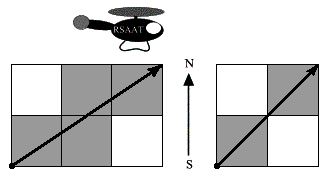

# City Blocks [⬀](https://acm.timus.ru/problem.aspx?space=1&num=1139)

The blocks in the city of Fishburg are of square form. `N` avenues running south to north and `M` streets running east to west bound them. A helicopter took off in the most southwestern crossroads and flew along the straight line to the most northeastern crossroads. How many blocks did it fly above?

*Note.* A block is a square of minimum area (without its borders).

## Input

The input contains `N` and `M` separated by one or more spaces. `1 < N, M < 32000`.

## Output

The number of blocks the helicopter flew above.

## Sample

<table>
<tr>
<th>input</th>
<th>output</th>
</tr>
<tr>
<td style="vertical-align: top">
<pre>
4 3
</pre>
</td>
<td style="vertical-align: top">
<pre>
4
</pre>
</td>
</tr>
<tr>
<td style="vertical-align: top">
<pre>
3 3
</pre>
</td>
<td style="vertical-align: top">
<pre>
2
</pre>
</td>
</tr>
</table>

## Notes

The figures for samples:

