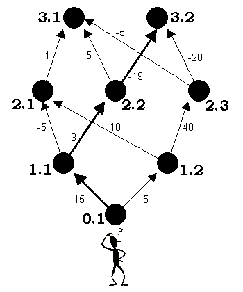

# Kind Spirits [⬀](https://acm.timus.ru/problem.aspx?space=1&num=1210)

Ivanushka the Fool lives at the planet of 0-level. It's very unpleasant to live there. An awful climate, 80 hours working week, ugly girls… He, as well as every inhabitant of his planet, dreams to get to a planet of `N`-th level. To the paradise.

At each of the `i`-th level planets there are several hyperspace transfers to some of the `(i+1)`-st level planets (but there are no reverse ways). Every transfer is guarded by a spirit. The spirits are usually evil: they demand many galactic bank-notes for each transfer. You know, everyone wants to go to a higher level planet. And one has to pay for the pleasure. More than Ivanushka can even imagine. However, extraordinary situations like a lack of a labor-force at one of the higher level planets sometimes happen, and then the spirits - the guards of the transfers — become kind. Sometimes they give galactic bank-notes themselves if only someone goes to their planets.

In order to embody his dream of heavenly planet Ivanushka has done two things. First of all, he has borrowed a complete map of the Universe. It's written on the map how much the spirits demand or give for a transfer from this or that planet to another one of the next higher level. Secondly, he has hired a staff of young talanted programmers in order that they will help him to draw the way on the map from his planet to the one of `N`th level so that he would spend for the spirits as little money or even earn as much as it is possible.

## Input

The first line contains an integer `N` (`0 < N < 30`) — an amount of levels of the planets on Ivanushka's map. Then follow `N` blocks of information that describe interlevel transfers. More precisely, the `i`th informative block describes the scheme of transfers from `(i−1)`-st level planets to the ones of `i`th level. Those blocks are separated with a line that contains the only symbol "`*`". Planets of each level are numbered with sequential positive integers starting from 1. Each level contains not more than 30 planets. There is the only planet of 0-level: the one that Ivanushka lives at. The first line of a block contains a number `Kᵢ` — an amount of planets of the `i`th level. THen follow `Kᵢ` lines — one for each planet of the `i`th level. Every line consists of numbers of planets separated with a space of the previous `(i−1)`st level that one can get from them to the current planet, and the corresponding fees. A fee for each transfer is an integer number from −32768 to 32767; a negative fee means that the kind spirit is ready to pay for such a transfer. Each description line is ended by zero.

## Output

should contain the only number — the minimal fee that Ivanushka might pay for a transfer to some planet of the `N`th level. The answer may be negative: it means that Ivanushka will not only get to a heavenly planet, but will earn some galactic bank-notes. It's known that there exists if only one way from Ivanushka's planet to the one of `N`th level.

## Sample

<table>
<tr>
<th>input</th>
<th>output</th>
</tr>
<tr>
<td style="vertical-align: top">
<pre>
3
2
1 15 0
1 5 0
*
3
1 -5 2 10 0
1 3 0
2 40 0
*
2
1 1 2 5 3 -5 0
2 -19 3 -20 0
</pre>
</td>
<td style="vertical-align: top">
<pre>
-1
</pre>
</td>
</tr>
</table>
