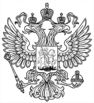

# Chernobyl’ Eagles [⬀](https://acm.timus.ru/problem.aspx?space=1&num=1222)

A Chernobyl’ eagle has several heads (for example, the eagle on the Russian National Emblem is a very typical one, having two heads; there exist Chernobyl’ eagles having twenty-six, one and even zero heads). As all eagles, Chernobyl’ eagles are very intelligent. Moreover, IQ of a Chernobyl’ eagle is exactly equal to the number of its heads. These eagles can also enormously enlarge their IQ, when they form a group for a brainstorm. IQ of a group of Chernobyl’ eagles equals to the product of IQ’s of eagles in the group. So for example, the IQ of a group, consisting of two `4`-headed eagles and one `7`-headed is `4*4*7=112`. The question is, how large can be an IQ of a group of eagles with a given total amount of heads.

## Input

There is one positive integer `N` in the input, `N ≤ 3000` — the total number of heads of Chernobyl’ eagles in a group.

## Output

Your program should output a single number — a maximal IQ, which could have a group of Chernobyl’ eagles, with the total amount of heads equal to `N`.

## Sample

<table>
<tr>
<th>input</th>
<th>output</th>
</tr>
<tr>
<td style="vertical-align: top">
<pre>
5
</pre>
</td>
<td style="vertical-align: top">
<pre>
6
</pre>
</td>
</tr>
</table>
