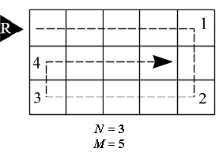

# Spiral [⬀](https://acm.timus.ru/problem.aspx?space=1&num=1224)

A brand new sapper robot is able to neutralize mines in a rectangular region having integer height and width (`N` and `M` respectively). Before the robot begins its work it is placed near the top leftmost cell of the rectangle heading right. Then the robot starts moving and neutralizing mines making a clockwise spiral way (see picture). The spiral twists towards the inside of the region, covering all the cells. The region is considered safe when all the cells are visited and checked by the robot.

Your task is to determine the number of the turns the robot has to make during its work.

## Input

The input contains two integers in the following order: `N`, `M` (`1 ≤ N, M ≤ 2³¹ − 1`).

## Output

The output consists of a single integer value — the number of the turns.

## Sample

<table>
<tr>
<th>input</th>
<th>output</th>
</tr>
<tr>
<td style="vertical-align: top">
<pre>
3 5
</pre>
</td>
<td style="vertical-align: top">
<pre>
4
</pre>
</td>
</tr>
</table>
