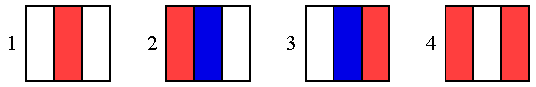

# Flags [⬀](https://acm.timus.ru/problem.aspx?space=1&num=1225)

On the Day of the Flag of Russia a shop-owner decided to decorate the show-window of his shop with textile stripes of white, blue and red colors. He wants to satisfy the following conditions:

1. Stripes of the same color cannot be placed next to each other.
2. A blue stripe must always be placed between a white and a red or between a red and a white one.

Determine the number of the ways to fulfill his wish.

### Example. 
For `N = 3` result is following:

## Input

`N`, the number of the stripes, `1 ≤ N ≤ 45`.

## Output

`M`, the number of the ways to decorate the shop-window.

## Sample

<table>
<tr>
<th>input</th>
<th>output</th>
</tr>
<tr>
<td style="vertical-align: top">
<pre>
1
</pre>
</td>
<td style="vertical-align: top">
<pre>
2
</pre>
</td>
</tr>
<tr>
<td style="vertical-align: top">
<pre>
2
</pre>
</td>
<td style="vertical-align: top">
<pre>
2
</pre>
</td>
</tr>
<tr>
<td style="vertical-align: top">
<pre>
3
</pre>
</td>
<td style="vertical-align: top">
<pre>
4
</pre>
</td>
</tr>
</table>
