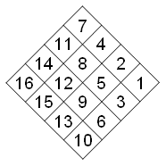

# Hotel [⬀](https://acm.timus.ru/problem.aspx?space=1&num=1319)

— You programmers are lucky! You don't have to deal with these terrible people – designers… This story happened with me not so long ago. We had an order from a company building a new hotel. One day they brought a sketch to our workshop. They said that THIS was invented by a very cool designer. They said they had paid heaps of money for THIS. So, THIS had to be built. In general, THIS was not a very complex thing. It was just a square set of shelves where a porter puts guests' mail. Usual hotels have usual stands with shelves for this purpose. But this cool designer had turned everything upside down! To be more precise, not exactly upside down, but upon a corner. Moreover, the cells should be numbered from the right to the left, from the top to the bottom, looking at THIS, staying on its corner, of course. Tell me please, how can the master attach the labels with numbers to THIS? He will look on the shelves, staying normally on its side, you know. He will get tangled on the fourth label already! I will get tangled on the seventh, myself… Actually one should make such designers to label the shelves themselves.

— Oh! You are the cool programmer, I know. Couldn’t you help me? I need just a printout of the table with an arrangement of the labels in the cells. But not in such way as THIS will hang on the wall, but as THIS stands on the table of my workshop. Yes, I understand that you are busy, but you are busy every time! Preparations to the Ural Championship, tests, solutions… So what? If you can’t do it yourself – entrust your competitors with this task. They are the best programmers all over the world, aren’t they? I don’t believe that they couldn’t print the desired table having the size of the square! I would never believe it! So… Excellent! I will take the desired printout away after the contest.

## Input

The input consists of the only one integer `N` (`1 ≤ N ≤ 100`), which is the size of the square.

## Output

You are to write a program that outputs the table of numbers, as they would be arranged when THIS would stand in the workshop. The label with number `1` should be in the upper right corner and other numbers should be arranged along the diagonals from the top to the bottom. The label with the last number (`N*N`) should be in the lower left corner.

## Sample

<table>
<tr>
<th>input</th>
<th>output</th>
</tr>
<tr>
<td style="vertical-align: top">
<pre>
3
</pre>
</td>
<td style="vertical-align: top">
<pre>
4 2 1
7 5 3
9 8 6
</pre>
</td>
</tr>
</table>
