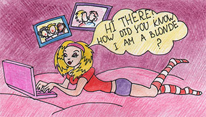

# AntiCAPS [⬀](https://acm.timus.ru/problem.aspx?space=1&num=1601)

The blonde Angela has a new whim: internet chats. Of course, as any blonde, she writes her messages using the upper case. You are the moderator of Angela's favorite chat and you're fed up with her upper-case messages. The problem is that Angela does not respond to your warnings. You decided to write a simple antiCAPS corrector, which would make Angela's messages readable.

The correction rules are very simple:

1. Sentences in a message consist of words, spaces and punctuation marks.
2. Words consist of English letters.
3. Sentences end with a full stop, exclamation mark, or question mark.
4. The first word of each sentence must start with a capital letter, and all other letters of the sentence must be lowercase.

## Input

You are given Angela's message, which consists of uppercase English letters, spaces, line breaks and punctuation marks: full stops, commas, dashes, colons, exclamation and question marks. Total length of message is not exceeding 10000 symbols.

## Output

Output the corrected message.

## Sample

<table>
<tr>
<th>input</th>
<th>output</th>
</tr>
<tr>
<td style="vertical-align: top">
<pre style="white-space:pre">
HI THERE!
HOW DID YOU KNOW I AM A BLONDE?
</pre>
</td>
<td style="vertical-align: top">
<pre style="white-space:pre">
Hi there!
How did you know i am a blonde?
</pre>
</td>
</tr>
</table>
