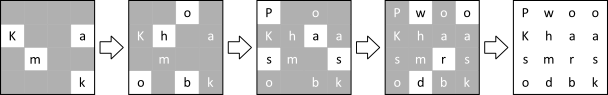

# Cipher Grille [⬀](https://acm.timus.ru/problem.aspx?space=1&num=1712)

Our program committee uses different tools for problem development: a mailing list, a version control system, an administration system of the Timus Online Judge website, and many others. Chairman of the program committee must constantly keep the passwords for these systems in his head. Of course, the passwords must be kept secret from the contestants, otherwise the problems may become known to them before the contest starts.

Not trusting his memory, the chairman wants to write down one of the passwords in a ciphered form. To do this, he plans to use a cipher grille he read about in one entertaining book.

A cipher grille is a `4 × 4` paper square in which four windows are cut out. Putting the grille on a paper sheet of the same size, the chairman writes down the first four symbols of his password in the windows (see fig. below). After that the chairman turns the grille clockwise by 90 degrees. The symbols written earlier become hidden under the grille and clean paper appears in the windows. He writes down the next four symbols of the password in the windows and again turns the grille by 90 degrees. Then he writes down the following four symbols and turns the grille once more. After that he writes down the last four symbols of the password. Now, without the same cipher grille, it is very difficult to restore the password from the resulting square with 16 symbols. Thus, the chairman is sure that no contestant will get access to the problems too early.

Assume that you obtained the grille used by the chairman and the resulting square with 16 symbols. Your task is to recover the chairman's password.

## Input

The first four lines contain the chairman's cipher grille. The window in it is denoted by the symbol “`X`” and the paper is denoted by “`.`”. The position of this grille corresponds to the position from which the chairman starts writing down his password. It is guaranteed that the grille is correct, which means that in the process of ciphering only empty cells appear in the windows. It is also known that the grille is connected, i.e. it is a single piece of paper.

The next four lines contain the square with the ciphered password. All the symbols in the square are lowercase or uppercase Latin letters.

## Output

Output the password of the chairman of the program committee as a string consisting of 16 symbols.

## Sample

<table>
<tr>
<th>input</th>
<th>output</th>
</tr>
<tr>
<td style="vertical-align: top">
<pre style="white-space:pre">
....
X..X
.X..
...X
Pwoo
Khaa
smrs
odbk
</pre>
</td>
<td style="vertical-align: top">
<pre style="white-space:pre">
KamkohobPassword
</pre>
</td>
</tr>
</table>
