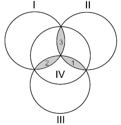

# Hamming Code [⬀](https://acm.timus.ru/problem.aspx?space=1&num=1792)

Let us consider four disks intersecting as in the figure. Each of the three shapes formed by the intersection of three disks will be called a *petal*.

Write zero or one on each of the disks. Then write on each petal the remainder in the division by two of the sum of integers on the disks that contain this petal. For example, if there were the integers 0, 1, 0, and 1 written on the disks, then the integers written on the petals will be 0, 1, and 0 (the disks and petals are given in the order shown in the figure).

This scheme is called a *Hamming code*. It has an interesting property: if you enemy changes secretely any of the seven integers, you can determine uniquely which integer has been changed. Solve this problem and you will know how this can be done.

## Input

The only line contains seven integers separated with a space, each of them being zero or one. The first four integers are those written on the disks in the order shown in the figure. The following three integers are those written on the petals in the order shown in the figure

## Output

Output one line containing seven integers separated with a space. The integers must form a Hamming code. The set of integers may differ from the input set by one integer at most. It is guaranteed that either the input set is a Hamming code or a Hamming code can be obtained from it by changing exactly one integer.

## Samples

<table>
<tr>
<th>input</th>
<th>output</th>
</tr>
<tr>
<td style="vertical-align: top">
<pre style="white-space:pre">
0 1 0 1 1 0 1
</pre>
</td>
<td style="vertical-align: top">
<pre style="white-space:pre">
0 1 0 0 1 0 1
</pre>
</td>
</tr>
<tr>
<td style="vertical-align: top">
<pre style="white-space:pre">
1 1 1 1 1 1 1
</pre>
</td>
<td style="vertical-align: top">
<pre style="white-space:pre">
1 1 1 1 1 1 1
</pre>
</td>
</tr>
</table>
