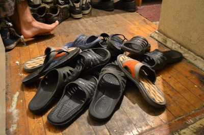

# Centipede's Morning [⬀](https://acm.timus.ru/problem.aspx?space=1&num=1876)

A centipede has 40 left feet and 40 right feet. It keeps `a` left slippers and `b` right slippers under its bed. Every morning the centipede puts on the slippers. It pokes its first left foot under the bed and puts on a random slipper, doing it in one second. If the slipper is left, the centipede passes to shoeing the second left foot. Otherwise, it takes off the slipper and puts it on any unshod right foot, spending one more second, so that it takes two seconds altogether to put on such a slipper. If there are no unshod right feet, the centipede throws the slipper to a corner of the room, also in one second, so that two seconds are spent altogether for this slipper. The process is continued until all the left feet are in left slippers. Then the centipede starts shoeing its right feet until all of them are shod.

Today the centipede has got out of bed on the wrong side, so it is preparing for the worst. How many seconds will it need for shoeing?

## Input

The only line contains the integers `a` and `b` (`40 ≤ a, b ≤ 100`).

## Output

Output the number of seconds the centipede will need for shoeing in the worst case.

## Sample

<table>
<tr>
<th>input</th>
<th>output</th>
</tr>
<tr>
<td style="vertical-align: top">
<pre style="white-space:pre">
40 40
</pre>
</td>
<td style="vertical-align: top">
<pre style="white-space:pre">
120
</pre>
</td>
</tr>
</table>
