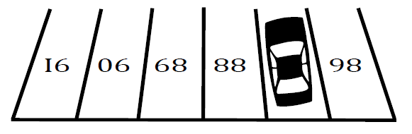

# Overturned Numbers [⬀](https://acm.timus.ru/problem.aspx?space=1&num=2031)

Little Pierre was surfing the Internet and came across an interesting puzzle:

What is the number under the car?

It took some time before Pierre solved the puzzle, but eventually he understood that there were overturned numbers `86`, `88`, `89`, `90`, and `91` in the picture and the answer was the number `87`.

Now Pierre wants to entertain his friends with similar puzzles. He wants to construct a sequence of `n` numbers such that its overturning produces a consecutive segment of the positive integers. Pierre intends to use one-digit integers supplemented with a leading zero and two-digit integers only. To avoid ambiguity, note that when the digits `0`, `1`, and `8` are overturned, they remain the same, the digits `6` and `9` are converted into each other, and the remaining digits become unreadable symbols.

## Input

The only line contains the number `n` of integers in a sequence (`1 ≤ n ≤ 99`).

## Output

If there is no sequence of length `n` with the above property, output “`Glupenky Pierre`” (“`Silly Pierre`” in Russian). Otherwise, output any of such sequences. The numbers in the sequence should be separated with a space.

## Samples

<table>
<tr>
<th>input</th>
<th>output</th>
</tr>
<tr>
<td style="vertical-align: top">
<pre style="white-space:pre">
2
</pre>
</td>
<td style="vertical-align: top">
<pre style="white-space:pre">
11 01
</pre>
</td>
</tr>
<tr>
<td style="vertical-align: top">
<pre style="white-space:pre">
99
</pre>
</td>
<td style="vertical-align: top">
<pre style="white-space:pre">
Glupenky Pierre
</pre>
</td>
</tr>
</table>
