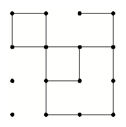

# Squares [⬀](https://onlinejudge.org/index.php?option=com_onlinejudge&Itemid=8&category=4&page=show_problem&problem=137)

A children’s board game consists of a square array of dots that contains lines connecting some of the
pairs of adjacent dots. One part of the game requires that the players count the number of squares of
certain sizes that are formed by these lines. For example, in the figure shown below, there are 3 squares
— 2 of size 1 and 1 of size 2. (The “size” of a square is the number of lines segments required to form
a side.)



Your problem is to write a program that automates the process of counting all the possible squares.

## Input

The input file represents a series of game boards. Each board consists of a description of a square array of `n²` dots (where `2 ≤ n ≤ 9`) and some interconnecting horizontal and vertical lines. A record for a
single board with `n²` dots and m interconnecting lines is formatted as follows:

- Line 1: `n` the number of dots in a single row or column of the array
- Line 2: `m` the number of interconnecting lines

Each of the next m lines are of one of two types:

- `H i j` indicates a horizontal line in row `i` which connects the dot in column `j` to the one to its right in column `j + 1`

or

- `V i j` indicates a vertical line in column i which connects
the dot in row `j` to the one below in row `j + 1`

Information for each line begins in column 1. The end of input is indicated by end-of-file. The first record of the sample input below represents the board of the square above.

## Output

For each record, label the corresponding output with `Problem #1`, `Problem #2`, and so forth. Output for a record consists of the number of squares of each size on the board, from the smallest to the largest.

If no squares of any size exist, your program should print an appropriate message indicating so. Separate output for successive input records by a line of asterisks between two blank lines, like in the sample below.

## Sample Input
```
4
16
H 1 1
H 1 3
H 2 1
H 2 2
H 2 3
H 3 2
H 4 2
H 4 3
V 1 1
V 2 1
V 2 2
V 2 3
V 3 2
V 4 1
V 4 2
V 4 3
2
3
H 1 1
H 2 1
V 2 1
```

## Sample Output

```
Problem #1

2 square (s) of size 1
1 square (s) of size 2

**********************************

Problem #2

No completed squares can be found.
```
