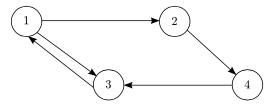

# [821 - Page Hopping](https://onlinejudge.org/index.php?option=com_onlinejudge&Itemid=8&category=10&page=show_problem&problem=762)

It was recently reported that, on the average, only 19 clicks are necessary to move from any page on
the World Wide Web to any other page. That is, if the pages on the web are viewed as nodes in a
graph, then the average path length between arbitrary pairs of nodes in the graph is 19.

Given a graph in which all nodes can be reached from any starting point, your job is to
find the average shortest path length between arbitrary pairs of nodes. For example, consider the
following graph. Note that links are shown as directed edges, since a link from page a to page b
does not imply a link from page b to page a.




The length of the shortest path from node `1` to nodes `2`, `3`, and `4` is 1, 1, and 2 respectively. 
From node `2` to nodes `1`, `3` and `4`, the shortest paths have lengths of 3, 2, and 1. 
From node `3` to nodes `1`, `2`, and `4`, the shortest paths have lengths of 1, 2,
and 3. 
Finally, from node `4` to nodes `1`, `2`, and `3` the shortest paths have lengths of 2, 3, and 1. The
sum of these path lengths is 1 + 1 + 2 + 3 + 2 + 1 + 1 + 2 + 3 + 2 + 3 + 1 = 22. Since there are
12 possible pairs of nodes to consider, we obtain an average path length of 22/12, or 1.833 (accurate
to three fractional digits).

## Input

The input data will contain multiple test cases. Each test case will consist of an arbitrary number of
pairs of integers, `a` and `b`, each representing a link from a page numbered `a` to a page numbered `b`. Page
numbers will always be in the range `1` to `100`. The input for each test case will be terminated with a
pair of zeroes, which are not to be treated as page numbers. An additional pair of zeroes will follow
the last test case, effectively representing a test case with no links, which is not to be processed. The
graph will not include self-referential links (that is, there will be no direct link from a node to itself),
and at least one path will exist from each node in the graph to every other node in the graph.

## Output

For each test case, determine the average shortest path length between every pair of nodes, accurate to
three fractional digits. Display this length and the test case identifier (theyre numbered sequentially
starting with 1) in a form similar to that shown in the sample output below.

### Sample Input
```
1 2 2 4 1 3 3 1 4 3 0 0
1 2 1 4 4 2 2 7 7 1 0 0
0 0
```

### Sample Output
```
Case 1: average length between pages = 1.833 clicks
Case 2: average length between pages = 1.750 clicks
```
