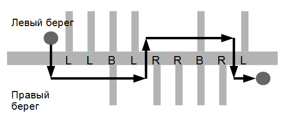

# Поход [⬀](https://contest.yandex.ru/contest/80940/problems/B/)

Группа школьников решила сходить в поход вдоль Москвы-реки. У Москвы-реки 
существует множество притоков, которые могут впадать в неё как с правого, так и 
с левого берега.

Школьники хотят начать поход в некоторой точке на левом берегу и закончить поход 
в некоторой точке на правом берегу, возможно, переправляясь через реки несколько 
раз. Как известно, переправа как через реку, так и через приток представляет 
собой определённую сложность, поэтому они хотят минимизировать число совершённых 
переправ. Переправляться через реку и притоки можно только перпендикулярно их 
течению (т.е. нельзя переправиться через реку и приток «по диагонали»).

Школьники заранее изучили карту и записали, в какой последовательности в 
Москву-реку впадают притоки на всём их маршруте.

Помогите школьникам по данному описанию притоков определить минимальное 
количество переправ, которое им придётся совершить во время похода.

## Формат ввода
Единственная строка содержит описание Москвы-реки между начальной и конечной 
точкой похода. Длина строки не превосходит `200` символов.

Каждый символ строки может быть одной из трёх латинских букв `L`, `R` или `B`. 
Буква `L` означает, что очередной приток впадает в реку с левого берега, `R` — 
приток впадает в реку с правого берега и B — притоки впадают с обоих берегов 
реки в одном месте. Поход начинается на левом берегу перед описанной частью 
реки и заканчивается на правом берегу после описанной части.

## Формат вывода
Выведите одно целое число — минимальное количество переправ.

## Пример
### Ввод
```
LLBLRRBRL
```

### Вывод
```
5
```

### Примечания

Рисунок к приведённому выше примеру.


